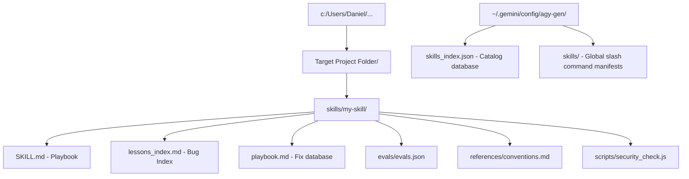

# Agy-gen-documentation.md — Antigravity Generator Guide (Caveman Style)

> [!NOTE]
> Dense, high-density documentation for agy-gen toolset. Future-proof. Covers architectures, commands, prompting, and tests.

---

## 🛠️ 1. System Architecture

agy-gen is a premium, zero-dependency skill-engine, hook-rule, and multi-agent system generator.

### Workspace Footprint Map


### Config Directories (Isolated):
* **Root folder**: `~/.gemini/config/agy-gen/` (mapped platform-agnostically via `os.homedir()`).
* **Registry Database file**: `~/.gemini/config/agy-gen/skills_index.json`
* **Global command manifests**: `~/.gemini/config/agy-gen/skills/`

---

## 📝 2. Unified Prompt Architecture (UPA)

Every generated `SKILL.md` template is structured according to the **Unified Prompt Architecture (UPA)**, optimizing execution performance across both frontier and non-frontier models.

### UPA Rules:
1. **Static-First Structuring**: Place all immutable instructions, roles, contexts, and constraints inside stable XML tags at the top of the file. Keeps context prefix-cached.
2. **Behavioral Success Precision**: Define strict execution boundaries and forbidden actions under exact XML tags using literal, unambiguous success metrics (no vague terms).
3. **Outcome-First Autonomy**: Define the final state deliverables and exit codes clearly. Allow reasoning agents execution path autonomy.

### Schema Template Layout:
```xml
<instructions>
  <role>Define agent persona/casing.</role>
  <context>Define module context, conventions guides, autolearner references.</context>
  <task_definition>Specify exact lint/compilation commands, target folders.</task_definition>
  <output_format>Define exit codes (0 = Success, 1 = Error) and deliverables.</output_format>
  <scope_constraints>Strict sandboxing limits, credentials firewalls.</scope_constraints>
</instructions>
```

---

## 🚀 3. CLI Command & Parameters Reference

agy-gen operates either as a guided interactive terminal or via specialized query flags.

### Interactive Guided Generator:
```bash
# Launch guide (Skill / Hook / Agent / System coordinates)
npm run generate
```

### Administrative & Query Parameters:
```bash
# 1. List all globally cataloged skills across projects
agy-gen --list

# 2. Fuzzy search registry index by keyword or tag
agy-gen --search <term>

# 3. Recursively crawl a folder to discover and index existing skills
agy-gen --scan <directory-path>

# 4. Scaffolding with global-index bypass (Bypasses registerSkill hook)
agy-gen --local-only

# 5. Unregister skill from registry index
agy-gen --remove <skill-name>

# 6. Unregister skill AND physically purge its folders from disk
# (purges are restricted strictly to files inside the global ~/.gemini/config/agy-gen/ path)
agy-gen --remove <skill-name> --purge
```

---

## 🔄 4. Autolearner Protocol Integration

Self-improving loops are coordinated using a synchronized dual-file layout in child skills:

### 1. `lessons_index.md` (Telemetry Log)
* High-level log storing exact Coordinate bullet points linking to playbook solution lines:
  ```markdown
  - `[ERROR_TAG_01]` Brief issue summary. Ref: playbook.md#L10-L20
  ```

### 2. `playbook.md` (Knowledge Database)
* Houses complete technical post-mortems, root causes, OS platform differences, and tested code workarounds grouped under anchoring markdown headers:
  ```markdown
  ## [ERROR_TAG_01] Brief issue summary
  - **Issue**: Description.
  - **Cause**: Structural root cause.
  - **Fix**: Instructions to bypass.
  - **Code Workaround**: Multi-line script workaround blocks.
  ```

---

## 🧪 5. Testing & Regressions Firewall

Unified testing ensures zero regressions. Dual-verification is mandated:

### Test Suites:
* **TDD Unit Tests (`scripts/test_indexing.js`)**: Validates database load/store integrity, fuzzy searches, and YAML frontmatter parses under isolated test environments.
* **E2E Sandbox Integration (`scripts/verify_index_sandbox.js`)**: Dynamically scaffolds mock skills, scanning and unregistering them via CLI wrapper executions, asserting correct exit statuses.

```bash
# Run full scaffolding, autolearner, unit, and E2E sandbox verification chain
npm run test
```

---

## 🛡️ 6. Core Safety Guardrails

1. **Credentials Firewall**: Plain-text keys/secrets are strictly scanned and banned. All templates use env variables.
2. **Directory Purge Shield**: The `--purge` command deletes physical directories *only* if they reside inside the global `~/.gemini/config/agy-gen/` workspace. Local developer project workspaces are structurally protected from accidental deletions.
3. **Robust CLI Atomic Writes**: All registry updates are written to temporary files first (`.tmp`) and then renamed, eliminating the risk of registry file corruption.

---

## 🆕 7. Interactive Agentic Skill Creation (Release 0.4.0 & 0.4.1)

Introduces Quick vs. Advanced modes to interactively build skills with custom requirements and hardened script engines.

### Creation Modes:
1. **Quick Mode**: Zero-config scaffolding. Generates Node.js (`.js`) verification script and standard plays.
2. **Advanced Mode**: Interactive customization of:
   * **Triggers**: Custom slash commands or context cues.
   * **Requirements**: Custom engine limits (e.g. `node: >=18`, `python: >=3.10`).
   * **Tasks**: Customized step-by-step agent instructions.
   * **Reviews**: Customized XML check criteria.
   * **Script Language**: Choose Node.js (`.js`) or Python (`.py`).

### Verification Script Stack:
* **Node.js**: Standard modern JS verification script (`security_check.js`).
* **Python**: Shebang-hardened (`#!/usr/bin/env python3`) verification script (`security_check.py`) with cross-platform environment fallback search path checks (`python3` -> `python` -> `py -3`) to avoid OS path crashes.

### Future-Proofing & Quality Hardening (Release 0.4.1):
1. **Dynamic Environment Baselining**:
   * Scaffolder-time detection queries the host machine's running engine versions (`process.versions.node` and dynamic Python CLI detection) to write precise, tailored requirements (e.g. `node: >=24`).
2. **Clean Router Descriptions**:
   * Isolated metapoziom triggering instructions from the description field in metadata, ensuring pure semantic matching for the Router.
3. **Active TDD Playbooks**:
   * Playbook tasks now explicitly instruct the agent to query and target the **highest compiler/runtime standard supported by the host** (Option 1) and to actively execute unit tests (Catch2, GTest, Pytest, Jest) to verify logic instead of relying on static comments code reviews.
4. **Dynamic Tags Hydration**:
   * `{{TAGS}}` is dynamically resolved and written to `<context>` blocks, eliminating plain placeholders.

---

## 👥 8. Dual-Mode Coordination Protocol & Archetypes (Release 0.4.2)

Resolves "AI slop" technology mixing and Greenfield (empty workspace) multi-agent initialization.

### The 6 DevTeam Archetypes
1. **Product Manager (`pm`)**: Roadmaps (`ROADMAP.md`), priority backlogs. Zero coding.
2. **Designer / Architect (`architect`)**: Normal SQL schemas, API schemas, wireframes (`docs/architecture/`). Zero coding.
3. **DevOps / Infra (`devops`)**: Optimized multi-stage Dockerfiles, compose, CI/CD actions. Zero business logic.
4. **Developer / Creator (`developer`)**: High-modern compiler coding, unit TDD suites, environment bootstrap (`npm init`, `cargo init`).
5. **QA / Tester (`qa`)**: E2E test suites (Playwright/Cypress), mock fixtures, coverages.
6. **Security Auditor / Safety (`auditor`)**: Hardened Python static scripts, threat models, secrets scans.

### Dual-Mode Coordination Protocol (DMCP)
Handles team playbooks dynamically based on directory state:
* **Orchestrated Mode**: Active parent coordinator governs execution via direct directives.
* **Choreographed Fallback**: Decentralized self-coordination if no orchestrator exists:
  * **Greenfield Safety**: If empty, `pm` and `architect` execute immediately to build plans. `devops`, `developer`, `qa`, and `auditor` save specs or immediately yield execution to prerequisite roles.
  * **Transition Flow**:
    ```mermaid
    graph TD
        EmptyDir[Empty Workspace] --> PM[PM: ROADMAP.md]
        PM --> Arch[Architect: Schema & Wireframes]
        Arch --> DevOpt[DevOps: virtualization & CI]
        Arch --> Dev[Developer: Dotnet / Npm / Cargo bootstrap]
        Dev --> Code[Core Business Logic & Unit tests]
        Code --> QA[QA: E2E Playwright tests]
        Code --> Audit[Auditor: Static OWASP scan]
    ```

---

## 📂 9. Dynamic Telemetry Registries & Safe Fallback Cascade (Release 0.4.3)

Resolves critical "AI Slop" context contamination in telemetry files (`lessons_index.md` & `playbook.md`) and optimizes prompt token density under the Unified Prompt Architecture (UPA).

### A. Dynamic Telemetry Registry (`TELEMETRY_REGISTRY`)
Every scaffolded skill receives stack-specific telemetry indices and playbooks, preventing cross-language leaks (e.g. Python developers trying to invoke Node's `process.env` in Python files).
* **Developer JS (`developer:js`)**: Telemetry covering Node.js platform checks (`os.platform()`), path concatenation (`path.join`), credentials loading (`process.env`), and readline streams (`rl.close()`).
* **Developer Python (`developer:py`)**: Telemetry covering Python's `pathlib.Path`, secure variables extraction (`os.getenv`), secure process runs (`subprocess.run`), and `pytest` module testing checks.
* **Designer / Architect (`architect`)**: Telemetry covering DDL schemas topological ordering (creating Foreign Key dependencies last) and responsive design layout specifications.
* **Product Manager (`pm`)**: Telemetry covering backlog milestone priorities (MoSCoW tags) and roadmap creep mitigation.
* **DevOps (`devops`)**: Telemetry covering container EPERM volume mount blocks and multi-stage optimizations.
* **QA (`qa`)**: Telemetry covering headless E2E browser timeout extensions and JSON mock payloads.
* **Auditor (`auditor`)**: Telemetry covering Semgrep static scans exclusions and regex credential scanning boundaries.

### B. Three-Tiered Safe Fallback Resolution Chain
To guarantee total stability and future-proof the scaffolder for languages like C++, Go, or Rust, `scaffoldAutolearner` cascades through three resolution tiers:
1. **Target Stack**: Look up `archetype:scriptLanguage` (e.g., `developer:cpp`).
2. **Archetype Fallback**: Look up `archetype` (e.g., `developer`).
3. **Global Agnostic Default**: Look up `default` (A safe, technology-agnostic playbook covering general platform paths, standard safety checks, and generic verification scripts).

### C. Prompt Token Optimization
Deleted the redundant `<autolearner>` block from the bottom of `templates/skill_template.md`. Since the playbook's `<context>` tag already instructs:
`- Always consult lessons_index.md and playbook.md before execution to bypass regression.`
Removing the extra 5-line XML block saves valuable context tokens on every LLM agent invocation.

---

## 🛡️ 10. Defense-in-Depth & Layer 3 CI/CD Workflows (Release 0.5.0)

Introduces a complete **Defense-in-Depth (DiD)** multi-layered security model to protect developer environments from credential leaks, bad sandboxing, and manual git hook bypasses.

### The 4-Layer Security Model:
1. **Layer 1: Agent Sandbox Constraints**: Safety system prompts and constraints intercept and block the AI from writing/committing raw secrets.
2. **Layer 2: Local Pre-Commit Hooks**: Client-side markdown validation hooks (`_hook.md`) trigger high-entropy regex sweeps and block local git commits upon detecting plaintext keys.
3. **Layer 3: Automated CI/CD Pipelines**: Out-of-the-box, zero-configuration GitHub Actions workflows (`.github/workflows/security_scan.yml`) executing on pushed branches to verify security checks on remote servers, rendering local bypasses (e.g. `git commit --no-verify`) completely useless.
4. **Layer 4: Server-Side Push Protection**: Recommends public/private repository push-protection flags to block raw secret pushes at the GitHub git-receive hook level.

### Scaffolded CI/CD Pipeline Workflow Spec (.github/workflows/security_scan.yml):
Automatically generated in newly scaffolded skill directories, customized to the active language runtime (Node.js/npm or Python/pip):
* **Trigger scope**: Evaluates pushes and pull requests targeting master/main branches.
* **Environment Provisioning**: Sets up node/python environment dynamically based on selected runtime during scaffolding.
* **Scan execution**: Executes the verification pipeline (`node scripts/security_check.js` or `python scripts/security_check.py`) and runs a zero-dependency static regular expression sweep (`grep -rnE "[a-zA-Z0-9_-]{24,}"`) across workspace files.
