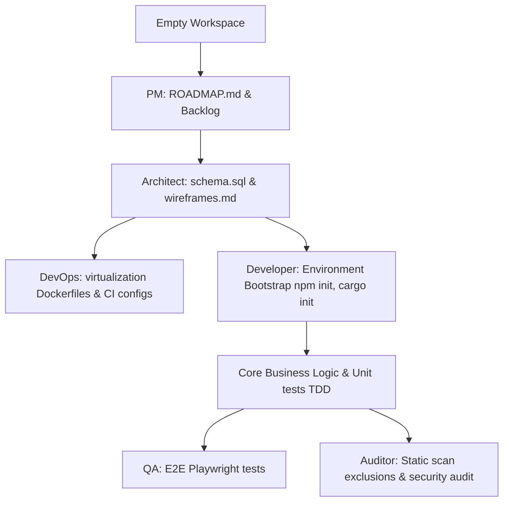

# Antigravity 2.0 Skill Generator (`agy-gen`)

> Premium, zero-dependency security-first scaffolder for Antigravity 2.0. Converts natural language developer intents into production-ready, isolated Skills, Agent Hooks, standalone Agent Profiles, and Coordinated Skill Systems.

> [!WARNING]
> **Active Development (Alpha Status)**: This repository represents an early version under active, rapid development. Architectural specifications, templates, CLI flags, and coordinate playbooks are subject to major breaking changes in future releases.

## 💡 What is `agy-gen`?

**Antigravity Generator (`agy-gen`)** is a professional-grade, zero-dependency, security-first command-line engine designed to automate the scaffolding and lifecycle management of isolated **AI Agent Skills, Hook Rules, Standalone Agent Profiles, and Coordinated Agent Systems** in localized developer workspaces.

Rather than writing unstructured playbooks that lead to "AI slop" or context contamination, `agy-gen` programmatically structures your agent environments with strict execution boundaries, stack-specific telemetry indices, and automated guardrails.

---

## 🚀 1. Installation & Quick Start

Run instantly without local installation, or clone the repository to run interactive setups.

### Option A: Direct Executable (`npx` One-Liner)
Run the generator directly from the remote GitHub repository using `npx`:
```bash
# Launch the interactive guided generator CLI
npx -y github:Danny0821/skills-training

# Query globally cataloged skills across your computer
npx -y github:Danny0821/skills-training --list

# Fuzzy search registered skills by tags or keywords
npx -y github:Danny0821/skills-training --search python
```

### Option B: Local Setup & Development
Clone the repository, configure standard parameters, and execute scripts locally:
```bash
# Clone the repository
git clone https://github.com/Danny0821/skills-training.git
cd skills-training

# Launch the interactive guided CLI
npm run generate

# Run the programmatic unit and E2E sandbox verification tests
npm run test
```

### Option C: Global Slash Command Registration (Zero-Keyboard Shortcut)
You can register the generator globally as a native slash command inside your AI Agent chat environment interface:
```bash
# Register the /generate slash command globally on your machine
npm run install-global
```
Once successfully executed, typing `/generate` directly in your chat interface will automatically boot up the guided generator, delivering a zero-keyboard setup experience.

---

## 🤖 2. How to Use in Agentic Mode

`agy-gen` is natively designed to be utilized and triggered by **AI Coding Agents** (such as Gemini, Antigravity, or other advanced coding assistants) operating in your local development workspace.

### 1. Intercepting a Shared Skill Workspace
When a user pastes a GitHub repository link or points an AI Agent to a folder containing a skill scaffolded by `agy-gen`, the primary `SKILL.md` file contains UPA-aligned onboarding manifests.
* The Agent automatically recognizes the generator directory layout.
* It will immediately initiate a jargon-free, friendly onboarding sequence to guide you through workspace commands.

### 2. Prompting the Agent to Scaffold new Skills
You can directly command your active coding agent to create custom skill profiles, pre-commit hook rules, or DevTeam systems for you.
* **Via Slash Command:** Simply type `/generate` in your chat interface. The active agent will capture the slash command manifest, execute the underlying generator globally, and guide you through the creation steps programmatically.
* **Via Prompting:** Send a clear text directive to your agent to invoke `agy-gen` under the hood:
  > **Prompt Directive Example:**
  > *"Create a new local-only Security Auditor skill named 'secret-scanner' using agy-gen. Setup advanced Python scanning requirements."*

### 3. The Self-Improving Telemetry Loop (Autolearner Protocol)
When an agent is performing software creation or infrastructure tasks under an `agy-gen` skill, it is bound to a closed-loop learning protocol:
1. **Regression Prevention:** Before beginning any code write or build action, the agent's XML instructions mandate that it reads `lessons_index.md` (Telemetry Index) and `playbook.md` (Telemetry Playbook) inside the skill folder to check for historical bugs or OS workarounds.
2. **Failure Logging:** If a sandbox run, build test, or security pre-commit validation fails, the agent writes the detailed failure context and fix criteria directly into the playbook, making it dynamically smarter for all future tasks.

---

## ⚙️ 3. CLI Command & Parameters Reference

`agy-gen` operates as an interactive guided wizard or via direct query command-line parameters:

```bash
# 1. List all globally cataloged skills across projects
antigravity-gen --list

# 2. Fuzzy search registry index by keyword or tag
antigravity-gen --search <term>

# 3. Recursively crawl a folder to discover and index existing skills
antigravity-gen --scan <directory-path>

# 4. Scaffolding with global-index bypass (bypasses registerSkill indexer)
antigravity-gen --local-only

# 5. Unregister skill from global registry database
antigravity-gen --remove <skill-name>

# 6. Unregister skill AND physically purge its folders from disk
# (purges are restricted strictly to files inside global ~/.gemini/config/ skills path)
antigravity-gen --remove <skill-name> --purge
```

---

## 👥 4. The 6 DevTeam Archetypes

To eradicate technology stack mixing ("AI slop") and Greenfield empty directory conflicts, all generated playbooks are partitioned into **6 specialized organizational profiles**:

| Archetype Profile | Core Responsibility | Key Deliverables | Tech Stack Limits |
| :--- | :--- | :--- | :--- |
| **`pm`** (Product Manager) | Roadmaps & Scrum priority backlog | `ROADMAP.md`, `BACKLOG.md` | Zero application code. |
| **`architect`** (Designer) | normalized schemas & UX wireframes | `docs/architecture/schema.sql`, `wireframes.md` | Zero application code. |
| **`devops`** (Infrastructure) | virtualization, CI/CD pipeline scripts | `Dockerfile`, `docker-compose.yml`, GitHub actions | Zero business logic. |
| **`developer`** (Creator) | Compiler standard coding, unit TDD | C#, C++, Rust, Node runtime source codes, `tests/` | Native compilation. |
| **`qa`** (Tester) | E2E automation tests, mock fixtures | Playwright, Cypress test suites in `tests/` | Zero developer bootstrap. |
| **`auditor`** (Security) | Threat models, OWASP security scans | Semgrep scanners rules, threat logs | Zero wireframe designs. |

---

## 🔄 5. Dual-Mode Coordination Protocol (DMCP)

Generated playbooks contain a dynamic, decentralized execution protocol inside their XML instructions:

* **Orchestrated Mode**: Active parent coordinator governs execution via direct parent-agent directives.
* **Choreographed Fallback**: Self-organizing execution flow for multi-agent greenfield projects:
  * **PM & Architect** assume execution priority in empty folders, bootstrapping roadmap manifests and DB schemas inside `docs/architecture/` to unblock engineers.
  * **Developer, DevOps, QA, and Auditor** identify empty workspaces, save initial configurations, and gracefully **yield execution** to prerequisite blueprint skills, preventing code creation without specifications.

### Greenfield Pipeline Flow:


---

## 📂 6. Dynamic Telemetry Registries & safe Fallback

Every generated skill receives an isolated telemetry index (`lessons_index.md`) and playbook (`playbook.md`) database aligned with its **Archetype** and **Language/Technology** environment:

* **Developer JS (`developer:js`)**: Telemetries regarding Node platform checks (`os.platform()`), path concatenate (`path.join`), environment variables (`process.env`), and readline streams (`rl.close()`).
* **Developer Python (`developer:py`)**: Telemetries regarding Python `pathlib.Path`, secure variables loads (`os.getenv`), secure subprocess parameters, and `pytest` module testing checks.
* **Designer / Architect (`architect`)**: Telemetries regarding Foreign Key topologically sorted DDL SQL statements.
* **Three-Tiered Fallback Resolution**: When scaffolding future/unsupported stacks (e.g. `C++`, `Go`, `Rust`), the engine resolves templates using a safe cascade resolver chain: `registryKey` (`archetype:lang`) $\rightarrow$ `archetype` $\rightarrow$ `default` (A safe, technology-agnostic playbook covering general platform paths, standard safety checks, and generic verification scripts), preventing system crashes.

---

## 📝 7. Unified Prompt Architecture (UPA)

Scaffolded skills conform strictly to the **Unified Prompt Architecture (UPA)**, maximizing semantic density and prefix-caching efficiencies across frontier models:

```xml
<instructions>
  <role>Specialized agent persona/casing.</role>
  <context>Target system dependencies, DMCP lifecycle coordination tags.</context>
  <task_definition>Lint/compilation commands, active unit test TDD parameters.</task_definition>
  <output_format>Output delimiters and exit code standards.</output_format>
  <scope_constraints>Sandboxed boundary constraints, credentials firewall rules.</scope_constraints>
</instructions>

<review_checks>
- Verification assertions.
</review_checks>

<autolearner>
- lessons_index.md & playbook.md coordinates mappings.
</autolearner>
```

---

## 🛡️ 8. Core Security Guardrails

1. **Credentials Firewall**: Plain-text passwords, tokens, or keys are scanned and completely banned. All templates default securely to env variables.
2. **Directory Purge Shield**: The `--purge` command deletes physical directories *only* if they reside inside the global user configuration path (`~/.gemini/config/`). Local developer project workspaces are structurally protected from accidental deletions.
3. **Atomic Registry Writes**: Central database indexes are written to temporary files first (`.tmp`) and then renamed, eliminating registry corruption.
