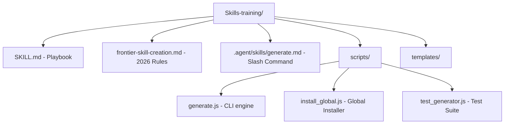

# antigravity-generator-0.1.0-mvp.md — Full MVP Documentation (Caveman Style)

> [!NOTE]
> Unified documentation. Antigravity 2.0 Generator Scaffolder (Release `0.1.0-MVP`).
> Token-sensitive. Zero-fluff. Perfect technical precision.

---

## 1. Architecture Overview
- **Workspace base**: `c:\Users\Daniel\Documents\1.Projects\Skills-training`
- **Core Engine**: Zero-dependency ES Module script `scripts/generate.js` using Node.js built-ins (`fs`, `path`, `readline`, `os`).
- **Templates Folder**: `templates/` holds high-density blueprints hydrated dynamically by the engine.
- **Git Branch Checkpoint**: Committed strictly locally on local branch `0.1.0-MVP` (f905b51).



---

## 2. Dynamic Installation & Scoping

### Local Scaffolding Command
- CLI walks user/agent through questions:
  ```bash
  npm run generate
  ```

### Global Slash Command (`/generate`)
- Registers `/generate` as a system-wide slash command in Antigravity.
- Run global installer to deploy manifest to user configurations folder:
  ```bash
  npm run install-global
  ```
- **Target folder resolved**: `C:\Users\Daniel\.gemini\config\skills\generate.md`
- Once deployed, type `/generate [idea]` in **any** folder on your machine. The AI agent acts as a Principal Prompt Architect, expands the idea, and writes sandboxed files.

### Scoping Options
- **Local Scope (1)**: Writes outputs inside `./output/[Name]` of the active project.
- **Global Scope (2)**: Writes outputs system-wide directly under `~/.gemini/config/skills/` or `~/.gemini/config/agents/`.

---

## 3. Coordinated "Skill Systems"
- Supports building unified multi-agent/multi-skill packages (like Agent Agency or GSD).
- Generates parent `SYSTEM.md` orchestrator manifest.
- **Per-Subskill Scoping**: When scaffolding systems in interactive mode, users choose Local vs. Global scope **for each child skill individually**.
- Manifest resolves and links local items relatively (`./skills/[name]/`) and global items absolutely (`C:\Users\Daniel\.gemini\config\skills\[name]`).

---

## 4. The 2026 Prompt Anatomy (Role-Context-Task-Format-Scope)
Generated playbooks are structured inside descriptively named XML tags to guarantee maximum literal follow-through on Claude 4.7, GPT-5.5, and Gemini 3.5:

```xml
<instructions>
  <role> — Persona description, capabilities, allowed models, and tool configurations. </role>
  <context> — Trigger conditions, variables, active Workspace paths, and Autolearner guides. </context>
  <task_definition> — Outcome-First objectives (GPT-5.5) and literal execution tasks (Claude 4.7). </task_definition>
  <output_format> — Exact output structural definitions and target XML delimiter boundaries. </output_format>
  <scope_constraints> — Sandboxed directories, whitelisted commands, and credential exclusions. </scope_constraints>
</instructions>
```

---

## 5. Self-Improving Autolearner Loop
Every generated component includes the dual-file learning protocol by default:
1. **`lessons_index.md` (Issue Index)**: Log of quirks/mistakes. Pointers match specific coordinates in the playbook (e.g. `playbook.md#L10-L20` or unique grep-anchors).
2. **`playbook.md` (Detailed KB)**: Contains deep technical error descriptions, post-mortems, and exact code workarounds (e.g. powerShell vs. bash pathing).

---

## 6. Strict Code Quality Firewall
- **The Caveman Policy**: Markdown playbooks, rules, manifests, and logging are written in ultra-dense, token-saving Caveman-speak (~70% token savings).
- **The Code Firewall**: Executable source code (JS, Python, Shell scripts) written by the generator is completely exempt from Caveman compression. It preserves descriptive names, detailed docstrings, error handling, and robust safety comments.

---

## 7. Verification Test Suite
- Automated test runner:
  ```bash
  node scripts/test_generator.js
  ```
- Programmatically tests:
  - Coordinated Systems with sub-skill directories.
  - Test suites (`evals/evals.json`) and progressive disclosure references directories.
  - Standalone Hooks and Agents.
  - Asserts correct folder structuring and variable hydration.
